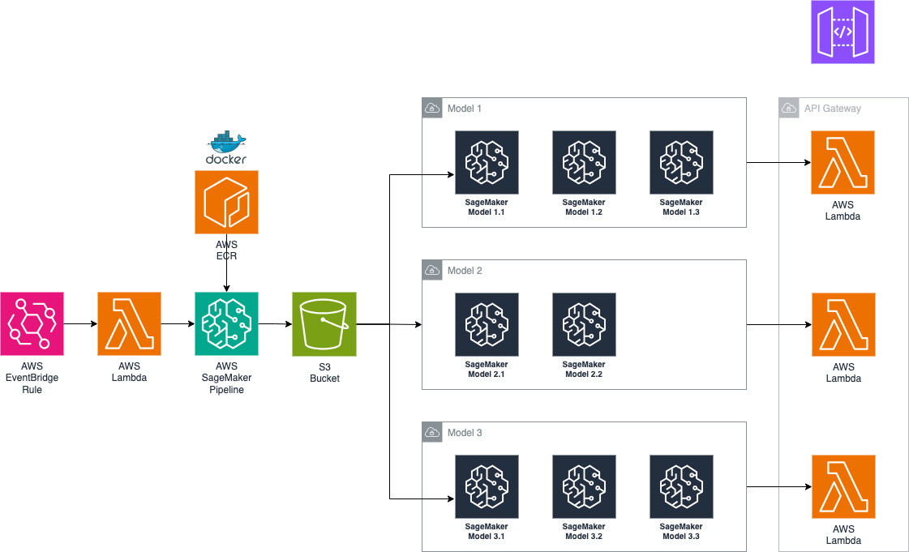

# aws-sagemaker-cdk
Deploying multiple LLM models to AWS SageMaker.


This architecture represents an automated, multi-model deployment pipeline utilizing several AWS services. It begins with an AWS EventBridge Rule that triggers an AWS Lambda function, which initiates an AWS SageMaker pipeline. The pipeline fetches the Docker image containing the machine learning model from Amazon ECR and retrieves the necessary training data stored in an S3 bucket. After the training process, the models are stored in different versions within SageMaker. The architecture is set up to handle multiple models (Model 1, Model 2, Model 3), where each model has multiple versions (e.g., Model 1.1, 1.2, 1.3). The trained models are deployed as SageMaker endpoints, and for each model, there is a corresponding AWS Lambda function that is connected to an API Gateway, allowing for real-time inference through a REST API. This architecture scales across various models and versions while maintaining modularity and automation, where each model's lifecycle is managed through SageMaker, and the inference requests are routed through the API Gateway and corresponding Lambda functions.



## Instructions

* Install AWS CDK:

```bash
npm -i
```

* Install Python dependencies:

```bash
virtualenv -p python3 .env
source .env/bin/activate
pip install -r requirements.txt
```

* Build the model Docker image:

```bash
docker buildx build --push \
    --platform "linux/amd64,linux/arm64" \
    -t "<account-id>.dkr.ecr.<region>.amazonaws.com/<environment-name>-repository:m1-v1" \
    ./models/m1/v1
```

* Deploy to AWS SageMaker:

```bash
cdk deploy --all --require-approval never --context environment_name=production
```
